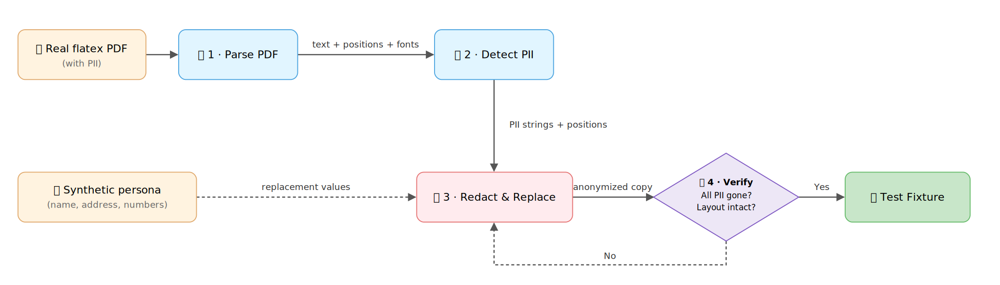

# flatex-pdf-cli

[](https://github.com/welworx/flatex-pdf-cli/actions/workflows/ci.yml)
[](https://goreportcard.com/report/github.com/welworx/flatex-pdf-cli)
[](https://github.com/welworx/flatex-pdf-cli/releases/latest)
[](go.mod)
[](LICENSE)

Get your transaction data out of flatex (a German online broker) PDF
statements and into something you can actually use: structured **JSON** for
your own tooling, **CSV** for spreadsheets, or ready-to-import files for
**[Portfolio Performance](https://www.portfolio-performance.info/)**. Point it
at a single PDF or a whole directory — trades, dividends, interest, fund
distributions, orders, crypto, savings plans.

> **Disclaimer:** This is an independent, unofficial open-source project. It is
> **not** affiliated with, endorsed by, sponsored by, or in any way associated
> with flatexDEGIRO AG, flatex, DEGIRO, or any of their subsidiaries. "flatex"
> and "flatexDEGIRO" are trademarks of their respective owners and are used
> here only to describe the document format this tool parses. Use at your own
> risk; always verify extracted data against the original documents.

## Features

- **Seven document types** — trades, dividends, interest, accumulating funds, orders, crypto settlements, savings plans
- **Three output formats** — JSON, CSV, and Portfolio Performance import files (English or German)
- **Batch processing** — single PDFs or whole directory trees; one bad file never aborts the batch
- **Depot metadata & audit trail** — optionally include depot number/holder and per-transaction source filename
- **AI-agent ready** — ships a Claude Code skill so coding agents can drive the CLI

## Quick Start

```bash
go install github.com/welworx/flatex-pdf-cli@latest
flatex-pdf-cli ~/Downloads/statement.pdf
```

```json
[
  {
    "document_type": "DIVIDEND",
    "isin": "IE00B3RBWM25",
    "date": "2025-10-01",
    "quantity": 74.45,
    "distribution_per_share": 0.422745,
    "gross_amount": 31.47,
    "net_amount": 22.43,
    "net_currency": "EUR"
  }
]
```

Pre-built binaries and other install options: [skill/INSTALL.md](skill/INSTALL.md).

## Supported Documents

The tool automatically detects and parses the following flatex document types:

| Type | Status | Description |
|---|---|---|
| TRADE | ✅ Full | Buy/sell confirmations (Wertpapierabrechnung Kauf/Verkauf) with pricing, costs, and gain/loss |
| DIVIDEND | ✅ Full | Dividend payment statements (Ausschüttung) with distribution details and withholding tax |
| INTEREST | ✅ Full | Interest payment notices (Zinsen) on cash accounts |
| ACCUMULATING | ✅ Full | Reinvestment/accumulation notices (Ertragsmitteilung, thesaurierende Fonds) |
| ORDER | 🟡 Partial | Order confirmations (Sammelauftragsbestätigung); one record per pending order — [see limitations](#known-limitations) |
| CRYPTO | ✅ Full | Crypto buy/sell settlements (Sammelabrechnung Kryptowerte) |
| SAVINGSPLAN | ✅ Full | Annual savings-plan settlement (Sammelabrechnung aus); one transaction per executed order row |

**German PDFs only** — non-German statements are rejected with an error (see
[Known Limitations](#known-limitations)).

## Usage

Process a single PDF file (JSON to stdout) or a directory of PDFs:

```bash
flatex-pdf-cli path/to/statement.pdf
flatex-pdf-cli path/to/documents/
```

### Flags

- `-o FILE` — Output file (stdout if not provided)
- `-format FORMAT` — Output format: `json` (default), `csv`, or `pp` (Portfolio Performance)
- `-lang LANG` — Language for `pp` output: `en` (default) or `de`
- `-include-source` — Add source filename to each transaction
- `-include-metadata` — Wrap output with depot metadata
- `-quiet` — Hide skipped/problematic files; emit only valid JSON
- `-version` — Show version and exit

When given a directory, the tool processes every `.pdf` it finds. A file it
cannot parse is reported on stderr and **skipped** — the rest still produce
output, so one bad document never aborts the batch. Use `-quiet` to suppress
the skip messages and get pure JSON on stdout.

### Examples

```bash
# Save output to file
flatex-pdf-cli -o output.json path/to/documents/

# Include depot metadata in output
flatex-pdf-cli -include-metadata path/to/trade-confirmation.pdf

# Include source filename with transactions (for audit trail)
flatex-pdf-cli -include-source -o transactions.json path/to/documents/

# Combine flags
flatex-pdf-cli -include-source -include-metadata -o output.json path/to/documents/
```

## Use Cases

### Prepare a Portfolio Performance import

`-format pp` parses your PDFs into two CSVs shaped for PP's CSV import —
trades and account transactions — so the import is a few clicks instead of
manual column mapping. Use `-lang de` if your PP runs in German; PP's column
auto-recognition is locale-sensitive, and `-lang de` emits the German headers,
`Typ` values, and number format it expects.

```bash
flatex-pdf-cli -format pp -lang de -o portfolio ~/Downloads/flatex
# writes portfolio-portfolio.csv and portfolio-accounts.csv
```

Read more: **[docs/portfolio-performance.md](docs/portfolio-performance.md)** — import walkthrough, `-lang de` details, caveats.

### Export CSV for spreadsheets

`-format csv` writes one row per transaction, every parsed field as a column.
Good for spreadsheets or your own scripts.

```bash
flatex-pdf-cli -format csv -o transactions.csv ~/Downloads/flatex
```

### Organize your downloads

Sort flatex PDFs from your Downloads folder into a structured archive — one
folder per depot, files renamed by date and document type — using the CLI's
JSON output and `jq`.

Read more: **[docs/organize-downloads.md](docs/organize-downloads.md)** — ready-to-paste shell recipes.

### Use from AI agents

This repo ships a ready-made Claude Code skill so AI coding agents can call
the CLI and consume its JSON (`flatex-pdf-cli -quiet -include-metadata <path>`).

Read more: **[skill/SKILL.md](skill/SKILL.md)** — the full agent contract and install steps ([skill/INSTALL.md](skill/INSTALL.md)).

## JSON Reference

Each transaction is a flat JSON object; `-include-metadata` wraps the list
with depot metadata:

```json
{
  "metadata": {
    "depot_number": "1234567890",
    "depot_holder": "Max Mustermann",
    "account_number": "9876543210"
  },
  "transactions": [
    {
      "document_type": "TRADE",
      "isin": "DE0005140008",
      "wkn": "514000",
      "date": "2024-06-15",
      "type": "BUY",
      "quantity": 10.0,
      "price": 25.50,
      "price_currency": "EUR",
      "gross_value": 255.00,
      "provision": 5.50,
      "final_amount": 248.50,
      "final_currency": "EUR"
    }
  ]
}
```

Full field reference (common, trade, dividend, interest, accumulating, order,
and crypto fields): **[docs/output-format.md](docs/output-format.md)**.

## Known Limitations

- **German PDFs only.** Document-type detection and field extraction are keyed
  to German labels (`Wertpapierabrechnung`, `Valuta`, `Devisenkurs`, …);
  non-German statements are detected and rejected with an error rather than
  silently mis-parsed. Numbers are parsed format-agnostically (both `1.234,56`
  and `1,234.56` are accepted), so the restriction is purely about field
  labels — English support needs a real English sample to map the labels.
- **ORDER `security_name` includes the execution venue.** gxpdf does not always
  put a space between the Bezeichnung and Ausf.platz/-art columns (e.g.
  `"GLOBAL X COPPER MINERS ETXETRA"`), so the venue is left attached to the name
  rather than split unreliably. Order confirmations therefore do **not** populate
  a separate `execution_venue`.
- **Metadata extraction (`depot_holder`, `depot_number`)** can be empty or noisy
  on documents whose layout places the value far from its label.
- **Account number (`Konto Nr.`)** is matched at a fixed length (11 digits) to
  work around a page-break run-on in text extraction; non-standard lengths won't
  match. (The depot number is matched at any length.)
- **SAVINGSPLAN WKN** is not present in Sammelabrechnung documents; the `wkn` field will be empty for these transactions.

Additional document types (e.g. tax reports) will be added as samples become available.

## Contributing & Development

Contributions are welcome — bug reports, code, and above all **real sample
documents**. The parsers only get better with real-world PDFs, but broker
statements are full of PII. This project's test fixtures are real flatex PDFs
with the PII redacted and replaced in place with synthetic values — visually
and structurally identical to production documents, safe for a public repo:



The full method — and why naively generated synthetic PDFs give you passing
tests and a broken parser — is covered in
**[Your AI's Test Fixtures Are Lying to You. Make real-world synthetic PDF files, PII safe!](https://pub.automatetherest.com/your-ais-test-fixtures-are-lying-to-you-0bc4f4ec7604)**

Project layout, test/lint setup, and the PR checklist:
[CONTRIBUTING.md](CONTRIBUTING.md). For issues, feature requests, or
questions, open an issue on GitHub.

## License

Licensed under the [MIT License](LICENSE). You're free to use, modify, and
redistribute it, including for commercial purposes, provided the copyright
notice is retained. The software is provided "as is", without warranty of any
kind and with no liability on the author's part — see the LICENSE file for the
full disclaimer.
