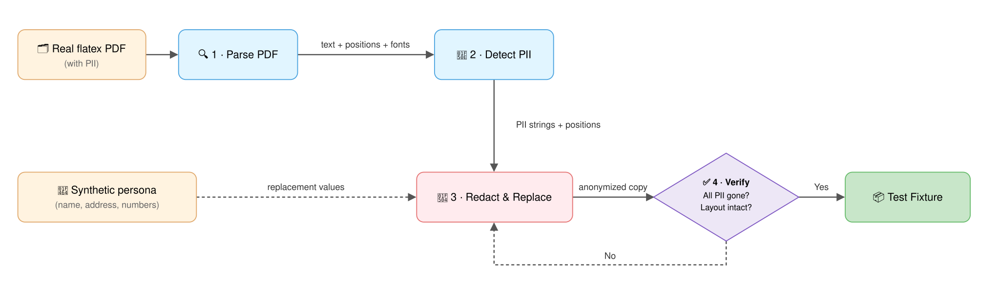

# flatex-pdf-cli

[](https://github.com/welworx/flatex-pdf-cli/actions/workflows/ci.yml)
[](https://coveralls.io/github/welworx/flatex-pdf-cli?branch=master)
[](https://github.com/welworx/flatex-pdf-cli/actions/workflows/codeql.yml)
[](https://github.com/welworx/flatex-pdf-cli/releases/latest)
[](go.mod)
[](LICENSE)

Get your transaction data out of flatex/flatexDEGIRO (a German online broker,
also operating in Austria) PDF statements and into something you can actually
use: structured **JSON** for your own tooling or **AI agents**, **CSV** for
spreadsheets, or ready-to-import files for
**[Portfolio Performance](https://www.portfolio-performance.info/)**. Point it
at a single PDF or a whole directory — trades, dividends, interest, fund
distributions, orders, crypto, savings plans.

Don't have the PDFs yet? [**flatex-fetch**](https://github.com/welworx/flatex-fetch)
logs into the flatex.at portal and downloads them for you; this tool then
turns them into structured data.

> **Disclaimer:** This is an independent, unofficial open-source project. It is
> **not** affiliated with, endorsed by, sponsored by, or in any way associated
> with flatexDEGIRO AG, flatex, DEGIRO, or any of their subsidiaries. "flatex"
> and "flatexDEGIRO" are trademarks of their respective owners and are used
> here only to describe the document format this tool parses. Use at your own
> risk; always verify extracted data against the original documents.

## Features

- **Seven document types** — trades, dividends, interest, accumulating funds, orders, crypto settlements, savings plans
- **Three output formats** — JSON, CSV, and Portfolio Performance import files (English or German)
- **Every charge, itemised** — commission and both expense lines, plus the fee breakdown printed beneath them and an exact total (`Provision`, `Eigene`/`Fremde Spesen`, `Courtage`, `Tradinggebühr`, `Regulierung`, …)
- **Unambiguous dates** — trade date, order date, booking date and value date are separate fields; no catch-all date whose meaning shifts by document type
- **Batch processing** — single PDFs or whole directory trees; one bad file never aborts the batch
- **Depot metadata & audit trail** — optionally include depot number/holder and per-transaction source filename
- **AI-agent ready** — ships a Claude Code skill so coding agents can drive the CLI

## Quick Start

```bash
brew install welworx/tap/flatex-pdf-cli
# or: go install github.com/welworx/flatex-pdf-cli@latest

flatex-pdf-cli ~/Downloads/statement.pdf
```

```json
[
  {
    "document_type": "DIVIDEND",
    "isin": "IE00B3RBWM25",
    "wkn": "A1JX52",
    "value_date": "2025-10-01",
    "quantity": 74.45,
    "gross_amount": 31.47,
    "gross_currency": "USD",
    "withholding_tax": 4.41,
    "withholding_tax_currency": "EUR",
    "exchange_rate": 1.172400,
    "net_amount": 22.43,
    "net_currency": "EUR",
    "distribution_per_share": 0.4227450,
    "distribution_currency": "USD",
    "ex_date": "2025-09-18"
  }
]
```

Pre-built binaries and other install options: [skill/INSTALL.md](skill/INSTALL.md).

## Supported Documents

The tool automatically detects and parses the following flatex document types:

| Type | Status | Description |
|---|---|---|
| TRADE | ✅ Full | Buy/sell confirmations (Wertpapierabrechnung Kauf/Verkauf) with pricing, costs, and gain/loss |
| DIVIDEND | ✅ Full | Dividend payment statements (Ausschüttung) with distribution details and withholding tax |
| INTEREST | ✅ Full | Interest payment notices (Zinsen) on cash accounts |
| ACCUMULATING | ✅ Full | Reinvestment/accumulation notices (Ertragsmitteilung, thesaurierende Fonds) |
| ORDER | 🟡 Partial | Order confirmations (Sammelauftragsbestätigung); one record per pending order — [see limitations](#known-limitations) |
| CRYPTO | ✅ Full | Crypto buy/sell settlements (Sammelabrechnung Kryptowerte) |
| SAVINGSPLAN | ✅ Full | Annual savings-plan settlement (Sammelabrechnung aus); one transaction per executed order row |

**German-language PDFs only** — non-German statements are rejected with an
error (see [Known Limitations](#known-limitations)). Developed and tested
against Austrian flatex statements; German (Germany) statements use the same
platform and should follow the same layout, but haven't been verified against
real samples yet — please open an issue if you hit a mismatch.

## Usage

Process a single PDF file (JSON to stdout) or a directory of PDFs:

```bash
flatex-pdf-cli path/to/statement.pdf
flatex-pdf-cli path/to/documents/
```

### Flags

- `-o FILE` — Output file (stdout if not provided)
- `-format FORMAT` — Output format: `json` (default), `csv`, or `pp` (Portfolio Performance)
- `-lang LANG` — Language for `pp` output: `en` (default) or `de`
- `-include-source` — Add source filename to each transaction
- `-include-metadata` — Wrap output with depot metadata; fails if the batch spans more than one depot
- `-quiet` — Hide skipped/problematic files; emit only valid JSON
- `-verbose` — Print progress to stderr: how many files parsed
- `-version` — Show version and exit

When given a directory, the tool processes every `.pdf` it finds. A file it
cannot parse is reported on stderr and **skipped** — the rest still produce
output, so one bad document never aborts the batch. Use `-quiet` to suppress
the skip messages and get pure JSON on stdout.

A run that skipped anything **exits non-zero** and prints how many of the files
parsed, even under `-quiet`. Output is still written: the documents that parsed
are worth having. This matters on a schedule, where the exit status is usually
the only thing anything looks at, and a partial batch reported as success is a
data gap nobody notices.

### Examples

```bash
# Save output to file
flatex-pdf-cli -o output.json path/to/documents/

# Include depot metadata in output
flatex-pdf-cli -include-metadata path/to/trade-confirmation.pdf

# Include source filename with transactions (for audit trail)
flatex-pdf-cli -include-source -o transactions.json path/to/documents/

# Combine flags
flatex-pdf-cli -include-source -include-metadata -o output.json path/to/documents/
```

### Upgrading

```bash
flatex-pdf-cli upgrade -check   # report whether a newer release is available
flatex-pdf-cli upgrade          # check, then prompt to download and install it
flatex-pdf-cli upgrade -y       # skip the confirmation prompt
```

Downloads the release asset for your platform from GitHub, verifies it
against the published `SHA256SUMS.txt`, and atomically replaces the running
binary.

## Use Cases

### Prepare a Portfolio Performance import

`-format pp` parses your PDFs into two CSVs shaped for PP's CSV import —
trades and account transactions — so the import is a few clicks instead of
manual column mapping. Use `-lang de` if your PP runs in German; PP's column
auto-recognition is locale-sensitive, and `-lang de` emits the German headers,
`Typ` values, and number format it expects.

```bash
flatex-pdf-cli -format pp -lang de -o portfolio ~/Downloads/flatex
# writes portfolio-portfolio.csv and portfolio-accounts.csv
```

Read more: **[docs/portfolio-performance.md](docs/portfolio-performance.md)** — import walkthrough, `-lang de` details, caveats.

### Export CSV for spreadsheets

`-format csv` writes one row per transaction, every parsed field as a column.
Good for spreadsheets or your own scripts.

```bash
flatex-pdf-cli -format csv -o transactions.csv ~/Downloads/flatex
```

### Organize your downloads

Sort flatex PDFs from your Downloads folder into a structured archive — one
folder per depot, files renamed by date and document type — using the CLI's
JSON output and `jq`.

Read more: **[docs/organize-downloads.md](docs/organize-downloads.md)** — ready-to-paste shell recipes.

### Use from AI agents

This repo ships a ready-made Claude Code skill so AI coding agents can call
the CLI and consume its JSON (`flatex-pdf-cli -quiet -include-metadata <path>`).

Read more: **[skill/SKILL.md](skill/SKILL.md)** — the full agent contract and install steps ([skill/INSTALL.md](skill/INSTALL.md)).

## JSON Reference

Each transaction is a flat JSON object; `-include-metadata` wraps the list
with depot metadata:

```json
{
  "metadata": {
    "depot_number": "1234567890",
    "depot_holder": "Max Mustermann",
    "account_number": "9876543210"
  },
  "transactions": [
    {
      "document_type": "TRADE",
      "isin": "DE0005140008",
      "wkn": "514000",
      "order_date": "2024-06-13",
      "trade_date": "2024-06-15",
      "value_date": "2024-06-17",
      "execution_time": "13:56",
      "type": "BUY",
      "quantity": 10,
      "price": 25.500000,
      "gross_amount": 255.00,
      "gross_currency": "EUR",
      "exchange_rate": 1.000000,
      "net_amount": -263.50,
      "net_currency": "EUR",
      "costs": {
        "provision": 5.50,
        "own_expenses": 0.00,
        "foreign_expenses": 3.00,
        "total": 8.50,
        "foreign_expenses_breakdown": {
          "courtage": 0.00,
          "trading_fee": 0.50,
          "settlement": 2.50,
          "closing_notes": 0.00,
          "ls_allocation": 0.00,
          "financial_transaction_tax": 0.00,
          "other": 0.00
        }
      },
      "custody_type": "Wertpapierrechnung",
      "depositary": "Clearstream Lux.",
      "deposit_country": "GB",
      "execution_venue": "XETRA"
    }
  ]
}
```

Six things worth knowing before you use the numbers:

- **Numbers keep the document's own precision, and nothing is rounded.**
  `Kurs : 110,000000 EUR` emits as `110.000000` and `Ausgeführt : 14 St.` as
  `14`, because a price quoted to six places is a different claim from one
  quoted to two. They are ordinary JSON numbers throughout, so a consumer that
  does not care can ignore all of this.
- **Nothing is invented, either.** Every number is printed on the page, or an
  exact sum of numbers printed on the page — `costs.total` is the only figure
  of the second kind. A field the statement does not state is omitted rather
  than filled in: no Devisenkurs means no `exchange_rate`, not a default of
  `1`; a savings-plan row that prints only `Stücke`, `Kurs` and `Betrag` yields
  exactly `quantity`, `price` and `net_amount`.
- **One field per date the document prints**, and no catch-all `date`.
  `trade_date` is the `Handelstag` (`Schlusstag` on crypto,
  `Ausführungsdatum` on older layouts) — never the date at the top of the
  letter. `order_date` is the `Auftragsdatum`, `value_date` the `Valuta`, and
  on a real statement all three are usually different days. A savings-plan row
  states a `Buchtag` and no `Handelstag`, so it carries `booking_date` and no
  trade date; dividends and interest carry only `value_date`; a pending order
  only `order_date`. `execution_time` carries the `Ausführungszeit` as a bare
  `"HH:MM"` — the document states no zone, so it is not folded into a
  timestamp. If you need a single date to sort or import by, that choice is
  yours: `trade_date ?? booking_date ?? value_date` is what the Portfolio
  Performance export uses.
- **The settlement fields are the same on every document type.** A trade's
  `Kurswert` and a dividend's `Bruttoausschüttung` both land in `gross_amount`;
  `Endbetrag` always lands in `net_amount`, whichever document it came from.
  The identity that ties them together is
  `net_amount = gross_amount ∓ costs.total ∓ withholding_tax` — deductions add
  to what a purchase costs you and subtract from what a sale pays you. The
  parser enforces it on every document it parses and fails loudly when it
  breaks.
- **Only `net_amount` carries a sign.** It is negative when money left the
  account. `gross_amount`, `withholding_tax` and everything under `costs` are
  unsigned magnitudes; which direction they apply in follows from `type`.
- **`costs.total` is the transaction's total charge** — `Provision` plus
  `Eigene Spesen` plus `Fremde Spesen`. The document prints the last of those
  as `* Fremde Spesen` and lists its components under the matching footnote, so
  the entries in `costs.foreign_expenses_breakdown` itemise `foreign_expenses`
  and are already counted in the total; adding them on top double-counts.
  `costs` is absent when a document has no charge block at all, which is how a
  real 0,00 EUR fee stays distinguishable from an unparsed one.

Full field reference (common, trade, dividend, interest, accumulating, order,
and crypto fields): **[docs/output-format.md](docs/output-format.md)**.

## Known Limitations

- **Savings-plan rows carry no charge, because the document prints none.** A
  `Sammelabrechnung aus` states only `Stücke`, `Ausf.-Kurs` and `Betrag` per row: a
  200,00 EUR execution at 134,2400 EUR buys 1,478695 shares. flatex withholds a
  fee — the shares are worth slightly less than the cash that moved — but no
  line names it, so the JSON and CSV report `quantity`, `price` and
  `net_amount` and nothing more. Earlier versions reconstructed the fee and a
  `gross_amount` from those three; both are gone, since a figure no line of the
  statement carries is not something an extractor should assert.

  The gap is still computed as a sanity check on the column layout: one that is
  negative by more than a cent, or larger than 5% of the amount settled, is
  treated as a layout change and fails the parse. And the Portfolio Performance
  export still derives the fee, rounded to the cent, because PP is accounting
  for what the purchase cost.
- **German-language PDFs only.** Document-type detection and field extraction
  are keyed to German labels (`Wertpapierabrechnung`, `Valuta`,
  `Devisenkurs`, …); non-German statements are detected and rejected with an
  error rather than silently mis-parsed. Numbers are parsed
  format-agnostically (both `1.234,56` and `1,234.56` are accepted), so the
  restriction is purely about field labels — English support needs a real
  English sample to map the labels. Developed and tested against Austrian
  flatex statements only; German (Germany) statements haven't been verified
  against real samples — please open an issue if you hit a mismatch.
- **ORDER `security_name` includes the execution venue.** gxpdf does not always
  put a space between the Bezeichnung and Ausf.platz/-art columns (e.g.
  `"GLOBAL X COPPER MINERS ETXETRA"`), so the venue is left attached to the name
  rather than split unreliably. Order confirmations therefore do **not** populate
  a separate `execution_venue`.
- **Metadata extraction (`depot_holder`, `depot_number`)** can be empty or noisy
  on documents whose layout places the value far from its label.
- **Account number (`Konto Nr.`)** is matched at a fixed length (11 digits) to
  work around a page-break run-on in text extraction; non-standard lengths won't
  match. (The depot number is matched at any length.)
- **SAVINGSPLAN WKN** is not present in Sammelabrechnung documents; the `wkn` field will be empty for these transactions.
- **`deposit_country` covers a fixed country list.** `Lagerland` is translated
  from its German name to an ISO 3166-1 alpha-2 code against a built-in table.
  gxpdf runs that column straight into the next one
  (`"GroßbritannienBemessungsgrundlage: 0,00 EUR"`), so matching a known name
  is also what separates the two — a country outside the table yields no code
  rather than a half-captured string. Please open an issue if a real statement
  names one the table misses.

Additional document types (e.g. tax reports) will be added as samples become available.

## Contributing & Development

Contributions are welcome — bug reports, code, and above all **real sample
documents**. The parsers only get better with real-world PDFs, but broker
statements are full of PII. This project's test fixtures are real flatex PDFs
with the PII redacted and replaced in place with synthetic values — visually
and structurally identical to production documents, safe for a public repo:



The full method — and why naively generated synthetic PDFs give you passing
tests and a broken parser — is covered in
**[Your AI's Test Fixtures Are Lying to You. Make real-world synthetic PDF files, PII safe!](https://pub.automatetherest.com/your-ais-test-fixtures-are-lying-to-you-0bc4f4ec7604)**

Project layout, test/lint setup, and the PR checklist:
[CONTRIBUTING.md](CONTRIBUTING.md). For issues, feature requests, or
questions, open an issue on GitHub.

## License

Licensed under the [MIT License](LICENSE). You're free to use, modify, and
redistribute it, including for commercial purposes, provided the copyright
notice is retained. The software is provided "as is", without warranty of any
kind and with no liability on the author's part — see the LICENSE file for the
full disclaimer.
